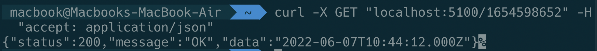
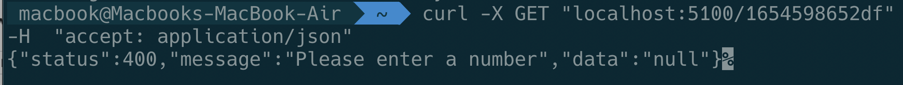
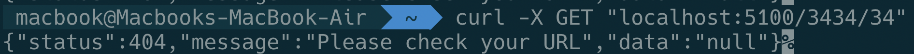
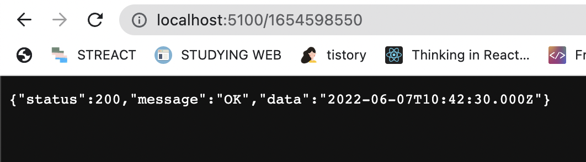

# epoch-ISO8601-converter-RESTful

> 사용 기술: node.js, express.js 

epoch를 요청하면 해당 epoch를 변환한 ISO8601 string을 json 형태로 응답하는 RESTful API 서버

## 실행 방법

```bash
# 디펜던시 설치
$ npm install

# 서버 실행
$ npm run start

# 1. 터미널에 curl 명령어 입력
$ curl -X GET "localhost:5100/(epoch)" -H  "accept: application/json"
# 2. 5100번 포트로 epoch를 요청 ex) localhost:5100/1654424647
$ localhost:5100/(epoch)

```

---


### `src/api/routes/index.js`

경로를 라우팅하는 모듈입니다.

### `src/service/convertFromEpochToISO8601.js`

전달받은 epoch를 ISO8601 string으로 반환하는 함수입니다.

### `src/app.js`

5100번 포트로 실행되는 서버입니다.

---

## 코드 스타일

```
feat        새로운 기능을 제공합니다.
docs        문서만 변경됩니다.
style       코드 작동에 영향을 미치지 않는 스타일 변경(빈 공간, 코드 포멧팅, 누락된 세미콜론 등)
refactor    버그를 수정하거나 기능을 추가하지 않는 코드 변경입니다.
chore       빌드 프로세스 또는 보조 도구 및 라이브러리(예: 문서 생성)에 대한 변경 사항.
```

## 실행 결과





